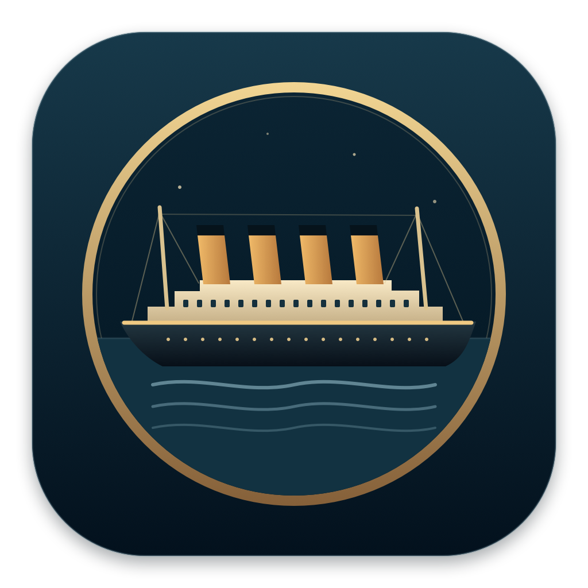
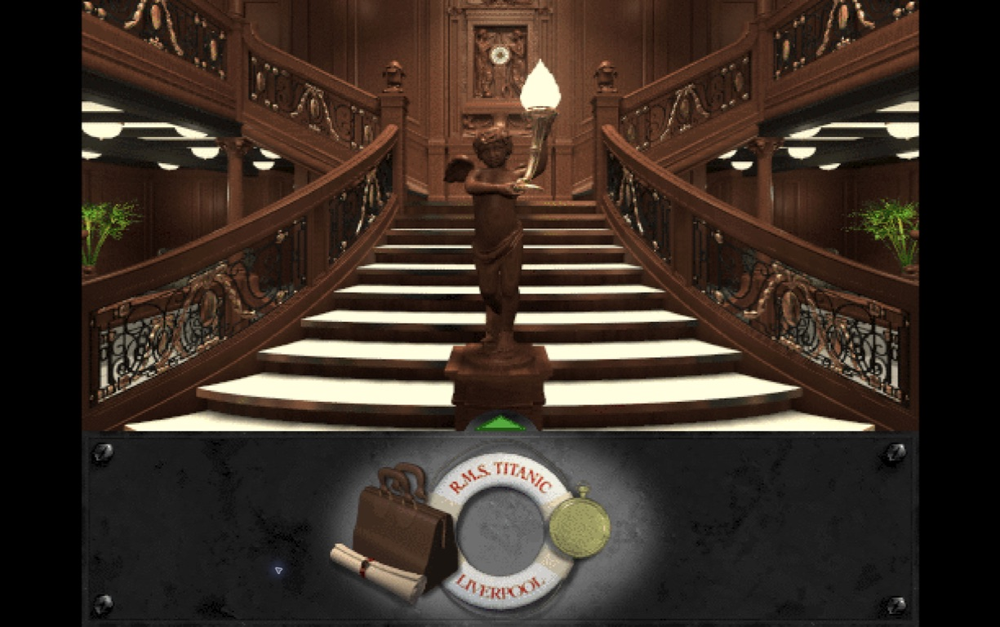
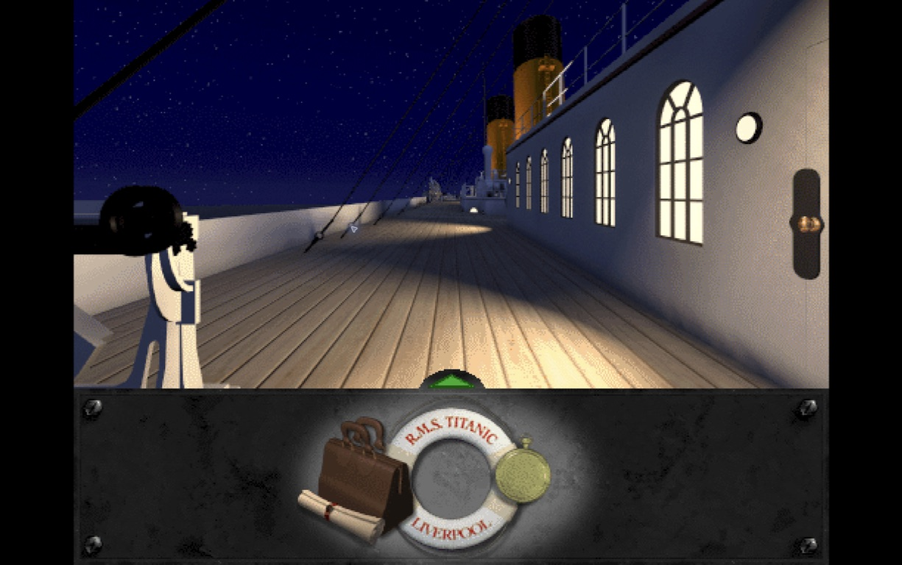
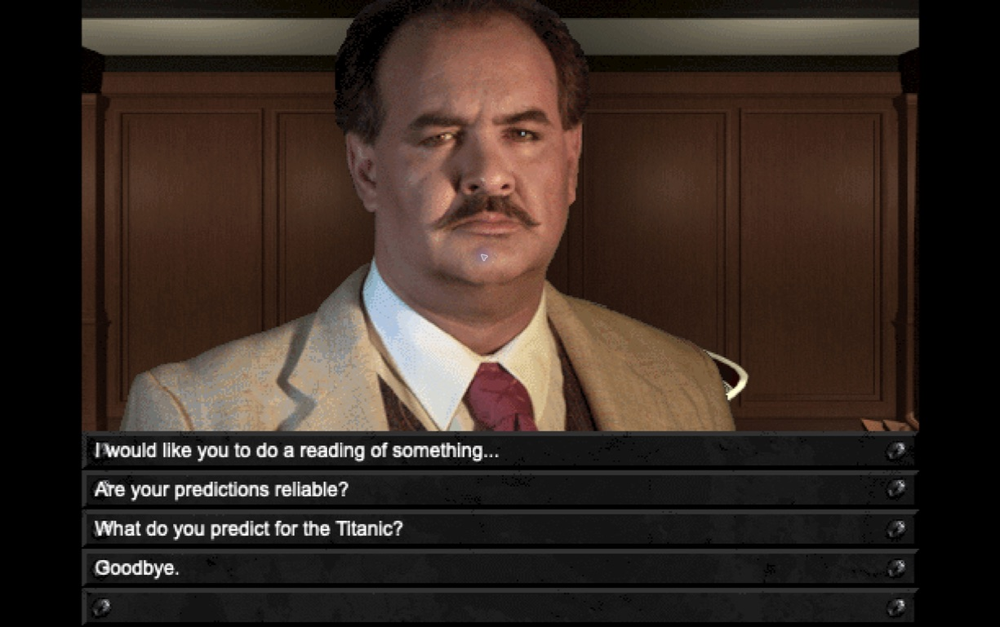

<p align="center"></p>

# Titanic for Mac

**Back aboard.** An unofficial macOS player for *Titanic: Adventure Out of Time* (1996), built on [dreamREfactory](https://github.com/dhobi/dreamrefactory).

Original rooms, movies, dialogue and music. Native fullscreen. Direct mouse and keyboard input. Both discs available throughout the voyage. Your progress saved outside the app, with previous versions archived before replacement.



## Play

You need your own copy of the original game. Official purchase pages: [GOG](https://www.gog.com/en/game/titanic_adventure_out_of_time) and [Steam](https://store.steampowered.com/app/785480/Titanic_Adventure_Out_Of_Time/).

**Check the [setup guide](docs/SETUP.md#supported-inputs) before buying for this player.** Original English PC discs and files matching GOG's **1.0 tour fix** data profile have passed preparation and gameplay checks. The [GOG offline-installer extraction step](docs/SETUP.md#gog-offline-installers-and-digital-installations) remains untested with the actual purchased installer; current Steam packages are unverified. The stores supply the Windows game; this project supplies the Mac player.

1. Download **Titanic-Mac-v0.1.0.zip** from [Releases](https://github.com/axx-archive/titanic-mac/releases).
2. Unzip it and move **Titanic.app** to Applications.
3. [Prepare your owned game data](docs/SETUP.md#prepare-and-validate-game-files), then open the app and import the resulting Disc 1 and Disc 2 folders.
4. Play. The original game data stays on your Mac; future launches work offline.

**The download does not include the original game or anyone's saved games.** Each supported disc folder contains its original `DATA` and `MOVIES` directories. Choose a parent containing both discs, or use **Choose Discs Separately**. Disc images and Windows installers must be extracted before the app can import them. See the [setup guide](docs/SETUP.md) for preparation, validation, and package limitations.

Requires **macOS 14 or later**. The app includes Apple Silicon and Intel binaries; hands-on verification was performed on Apple Silicon. This first release is locally signed, **not notarized by Apple**. If macOS blocks the downloaded app, follow [Apple's instructions for opening an app from an unidentified developer](https://support.apple.com/en-us/102445). You can also [build from source](#build-from-source).

## Set it up with Codex

Give Codex this repository. It can explain which original game to get, check the available setup route, and handle the local work once your files are downloaded:

```text
Set up Titanic for Mac from https://github.com/axx-archive/titanic-mac.
Read AGENTS.md and docs/SETUP.md. My game files, if any: [path or none].
If I don't have them yet, explain the official purchase options and current
compatibility before I buy. Once I download my copy, handle supported data
preparation, install the player, and get the game running. Preserve my files
and saves. Check fullscreen, controls, sound, and saving/loading after relaunch.
Ask only for an essential missing input or system action.
```

[AGENTS.md](AGENTS.md) gives agents the setup procedure and completion checks. [llms.txt](llms.txt) provides a short map of the repository. Codex can handle local preparation and verification; you handle purchases, store sign-in, and downloading your licensed game files.

## Controls and saves

| Action | Control |
| --- | --- |
| Walk and turn | Arrow keys |
| Interact / choose dialogue | Mouse |
| Fullscreen / window | Control–Command–F |
| Save while exploring | Command–S |
| Load a saved game | Command–O |
| Original game menu | Click the life preserver |
| Skip an animation | Escape |
| Quit | Command–Q |

The **Game** menu also imports and exports `.ti` saved games and opens your save folder in Finder. Opening a `.ti` file with the app imports and loads it. The game pauses when you switch away.

Progress lives in `~/Library/Application Support/Titanic Adventure Out of Time/Saves`. Previous versions live in the adjacent `Save Archives` folder. Moving or replacing the app does not replace your saves. Save before quitting; this is not an autosave system.

Original Windows `.ti` saves can be imported. New saves preserve full restoration state and should be reloaded in this Mac player; backward compatibility with the original Windows executable is not promised.

<p>  </p>

## How it works

[dreamREfactory](https://github.com/dhobi/dreamrefactory), by Daniel Hobi and contributors, reimplements the CyberFlix DreamFactory engine. It reads the original game's scripts and media. This project builds a native AppKit/WebKit host around that work.

The app serves its local game files through an internal URL scheme: no local web server, Wine installation, screen-capture scaler, or runtime package manager is required. Both discs retain separate namespaces. The save layer retains complete engine state, imports legacy saves, and archives older contents before an overwrite.

The engine is pinned to `b43a02668f3db36519bd5b44a5892fdefd292208` (Titanic package 0.9.67). Credit for the engine and format decoding belongs to dreamREfactory, DFET/M3tox and the other upstream contributors. See [third-party notices](native/restoration/THIRD_PARTY.md).

## Build from source

Install Xcode Command Line Tools, Git, Python 3, and Node.js 22 or 24 with npm. On macOS 14 or later:

```sh
git clone https://github.com/axx-archive/titanic-mac.git
cd titanic-mac
scripts/build-restored-app.sh --runtime-only
python3 scripts/verify-restored-app.py --runtime-only dist/public/Titanic.app
```

The build fetches the pinned engine and locked npm dependencies, then compiles a universal Mac app at `dist/public/Titanic.app`. It needs no discs or saved games to build. Import your own game data when you open it. Further build and test details are in [BUILDING.md](BUILDING.md).

## Verification and known limits

Hands-on testing includes interiors, the boat deck, conversations, engine-room ladders, fullscreen transitions, original save imports, new saves after quitting/relaunching, damaged-save recovery, and moving the app to another folder. The pinned engine's automated story route passed 30 tests across 27 segments with the tested English disc data. That is automated story coverage, not an audiovisual playthrough of every possible branch.

Occasional audio clipping was reported and has not been conclusively isolated. Some original effects have limited fidelity; the original audio has not been replaced or filtered. A harmless upstream diagnostic can occur while restoring one legacy inventory state. Please report reproducible gameplay issues with your macOS version, location in the game and steps to reproduce. Review diagnostics before sharing them; they may contain file names or local paths.

## License and attribution

The restoration source and original project icon are licensed under **GPL-3.0**; upstream license and contributor notices are retained. The app includes corresponding source and license information.

*Titanic: Adventure Out of Time* and its original game data belong to their respective rights holders. Screenshots here show the original game running in this player and are not covered by the source-code license. This project is an unofficial preservation effort and is not affiliated with CyberFlix, Activision, Nightdive Studios or any current rights holder.
