# Titanic for Godot

## Play quickly (Windows, Linux, macOS)

Download and extract the release for your platform, then use either source:

- **ISOs:** Drop both images beside the executable, or beside `Titanic.app` on macOS. Their filenames just need to contain `cd1` and `cd2`, for example `Titanic_CD1.iso` and `Titanic_CD2.iso`. Run Titanic; it finds them automatically. No mounting or extraction needed.
- **GOG / Steam:** Run Titanic and choose your installed game folder or its `LOCAL` folder. No conversion needed. You can also place a copy of `LOCAL` beside the player for automatic detection (on Windows, you can literally unzip the release into the installed game directory and launch titanic.exe).

## Play quickly (Android)

Install the APK and choose the folder containing both ISOs or your GOG/Steam game files. For ISOs, use filenames containing `cd1` and `cd2`. For GOG/Steam, select the game folder or `LOCAL` directly. Put the files somewhere selectable, such as a subfolder of Downloads.

Android imports the files into app storage. Keep the app open until it finishes. Both gamepad and touchscreen play are supported.

## Play quickly (PortMaster)

Extract the PortMaster ZIP into your handheld's ports folder, then add your game files:

- **ISOs:** Put both images inside `titanic`, with `cd1` and `cd2` in their filenames. They also work in `titanic/gamedata` or beside `Titanic.sh`.
- **GOG / Steam:** Copy the game's `LOCAL` folder into `titanic/gamedata`, keeping the folder name.

Launch Titanic from the handheld's ports menu. No ISO extraction or GOG/Steam conversion needed. The FRT runtime is included; see [offline patch setup](docs/PORTMASTER.md#installing-patches-without-internet) for consoles without networking.

F10 (or Start on controller) to access the engine menu. For the rest, read more below.

## more

A Godot player with a native Go engine for *Titanic: Adventure Out of Time* (1996), based on [titanic-mac](https://github.com/axx-archive/titanic-mac) and [dreamREfactory](https://github.com/dhobi/dreamrefactory). Bring your own game files.

Build with the commands in [BUILDING.md](BUILDING.md), then use your two ISOs, GOG/Steam game folder, or extracted discs. [Setup and mods](docs/SETUP.md) covers digital installs and M3tox's fixes, lounge unlock, and extended-content mod. On first start, download the M3tox 1.0.3 FULL patches, choose their ZIP, or play without them. Saves live outside the app; replaced saves are archived.

Use the arrow keys to move and the mouse to interact. On a handheld, use the left stick or D-pad for movement, dialogue replies and menus, then A to confirm. The right stick controls the pointer; L1 slows it, and L2/R2 cycle clickable targets. B goes back or skips speech. Start opens the menu. Controller settings lets you remap buttons and D-pad directions or restore the defaults. See [PortMaster controls](docs/PORTMASTER.md). Touchscreens support tapping, dragging and a virtual joystick. An onscreen keyboard handles text entry with touch or a controller.

For a personal APK or PortMaster ZIP with your game files included, use the local Go builder in [BUILDING.md](BUILDING.md#personal-packages-with-game-files). This mode runs locally and is not part of CI. You can also generate a [2x HD artwork pack](docs/HD.md) for rooms and interface graphics and include it in either package.

CI builds Windows x64 and ARM64 portable packages, macOS Intel and Apple Silicon apps, Linux packages, a PortMaster ZIP, and an [Android ARM64 APK](docs/ANDROID.md).

## HD artwork

The same Grand Staircase save, with original artwork and the optional FSDedither Riven pack. [Make your own pack](docs/HD.md).

| Original | FSDedither Riven |
| --- | --- |
| <a href="docs/images/hd/boat-original.png">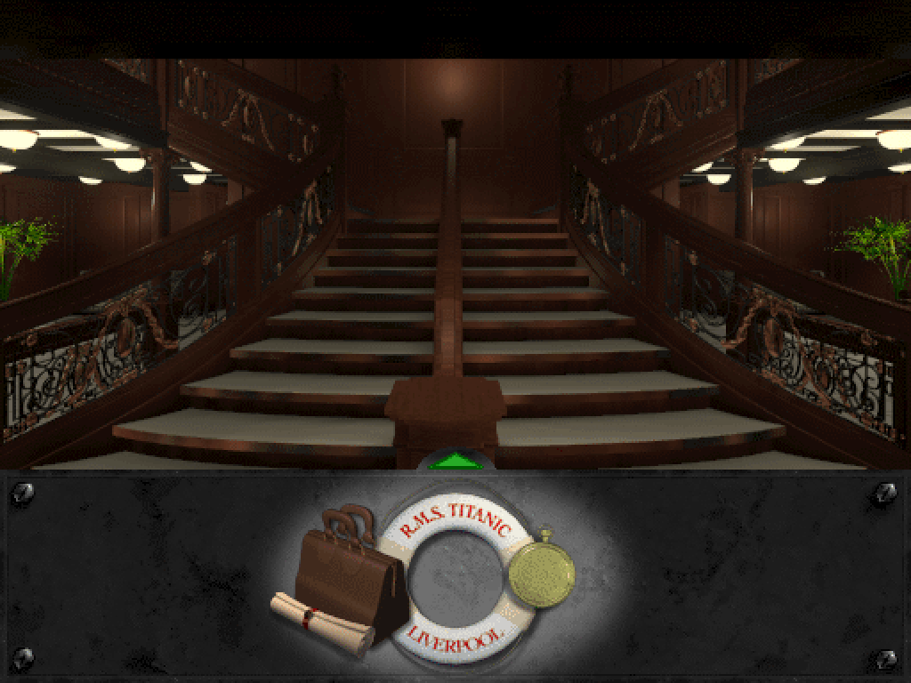</a> | <a href="docs/images/hd/boat-riven.png">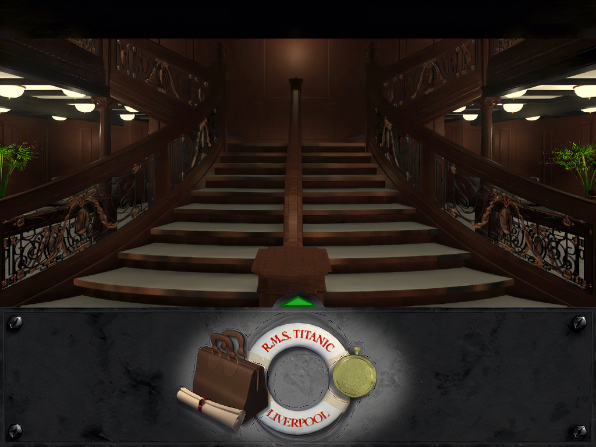</a> |

More comparisons: rooms, faces and UI

### Life preserver

| Original | FSDedither Riven |
| --- | --- |
|  | <a href="docs/images/hd/life-riven.png">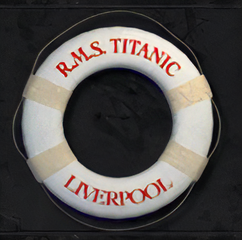</a> |

### Life preserver: transparent inventory sprite

| Original | FSDedither Riven | Nearest-neighbor 2x |
| --- | --- | --- |
|  | <a href="docs/images/hd/life-cutout-riven.png">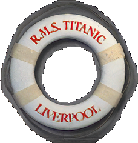</a> | <a href="docs/images/hd/life-cutout-nearest.png">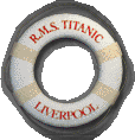</a> |

[In-game view with the nearest-neighbor preserver and Riven scenery](docs/images/hd/boat-nearest.png).

### HELP button

| Original | FSDedither Riven |
| --- | --- |
|  | <a href="docs/images/hd/help-riven.png">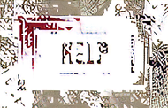</a> |

### Grand Staircase

| Original | FSDedither Riven |
| --- | --- |
| <a href="docs/images/hd/staircase-original.png">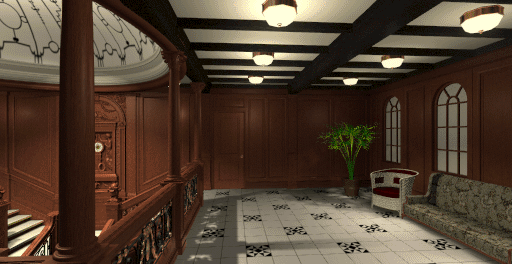</a> | <a href="docs/images/hd/staircase-riven.png">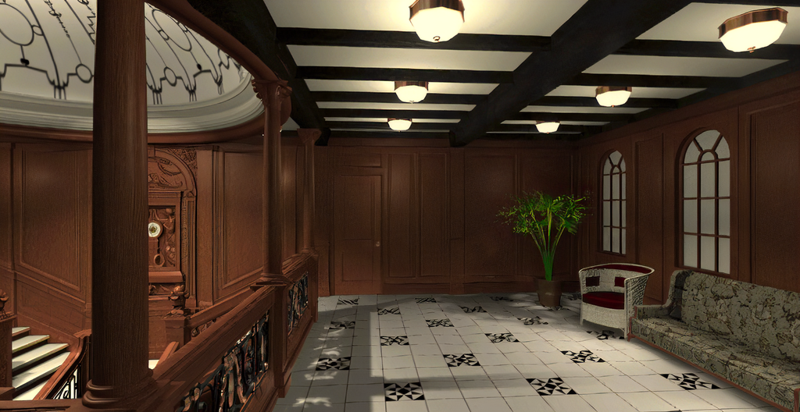</a> |

### Penny Pringle

| Original | FSDedither Riven |
| --- | --- |
|  |  |

### Colonel Zeitel

| Original | FSDedither Riven |
| --- | --- |
| <a href="docs/images/hd/zeit1-original.png">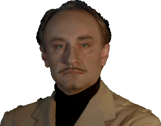</a> |  |

### Jones

| Original | FSDedither Riven |
| --- | --- |
| <a href="docs/images/hd/jones2-original.png">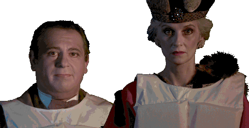</a> |  |

### Bedsit

| Original | FSDedither Riven |
| --- | --- |
|  | <a href="docs/images/hd/cabin-riven.png">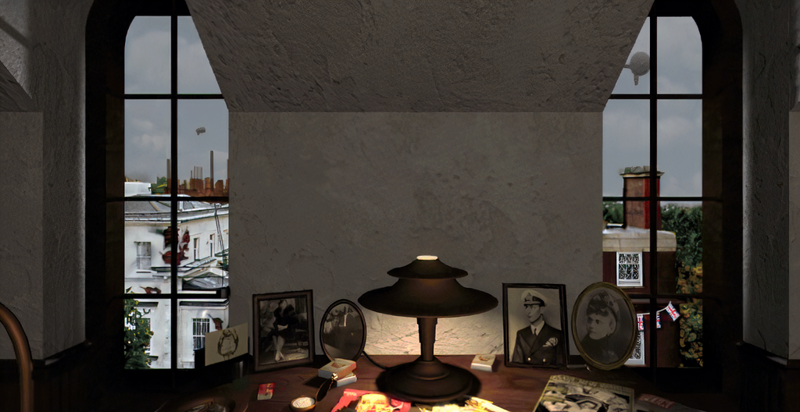</a> |

### Cipher puzzle

| Original | FSDedither Riven |
| --- | --- |
| <a href="docs/images/hd/cipher-original.png">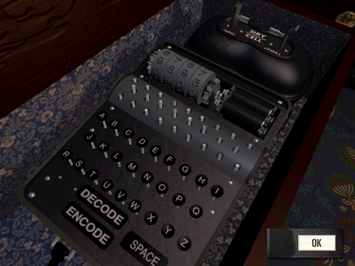</a> | <a href="docs/images/hd/cipher-riven.png">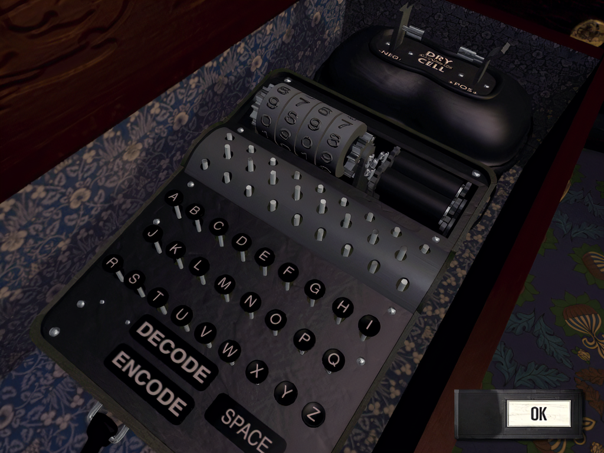</a> |

Thank you to Daniel Hobi and the dreamREfactory contributors; axx-archive for the Mac port; M3tox for DFET and TAOOT mods; MRXstudios for reverse engineering; the Godot, Go, QuickJS, QuickJS-NG, FRT, PortMaster, SDL, and gptokeyb teams; Jacob for FSDedither Riven; Xintao Wang and the Real-ESRGAN and BasicSR contributors; the PyTorch, NumPy, Liberation Fonts and Pillow authors; Evan Wallace for esbuild; and the original CyberFlix team. [Credits and licenses](CREDITS.md) lists the projects and authors behind this work.

Source: GPL-3.0. Public builds do not include the full game. Patch files remain credited to M3tox and their respective rights holders.
