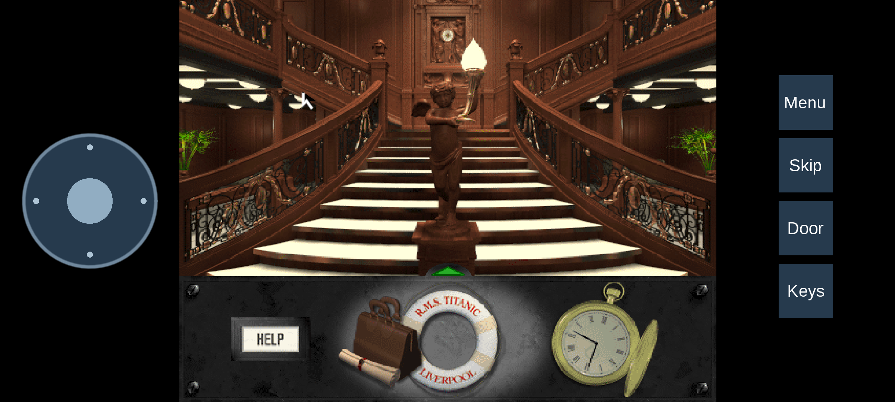

# Make your own HD artwork

This is a local build for your own copy of Titanic. Real-ESRGAN makes 2x versions of room views, sprites, buttons, inventory art and puzzle screens. Your original files stay untouched. Keep the generated artwork and packages private.

## Android comparison

The Grand Staircase with original artwork and the 2x HD pack, including the inventory interface. Open either screenshot to see it at full size.

| Without the HD pack | With the HD pack |
| --- | --- |
| [](images/android-grand-staircase-original.png) | [](images/android-grand-staircase-hd.png) |

## Prepare

Use a checkout of this repository, Go 1.26.4, Python 3.11 or newer, and a computer with several GB of free memory and disk space. The commands below use Linux, including WSL on Windows. Other systems need a compatible PyTorch installation and the corresponding Python environment paths.

Put your two CD ISOs in one folder, or use your GOG/Steam installation. Extracted `cd1` and `cd2` folders also work. In these examples, `originalgame` is that folder; replace it with your own path.

Run from the repository root:

```sh
python3 -m venv .tools/hd-venv
.tools/hd-venv/bin/pip install numpy==2.2.6 Pillow==11.3.0
.tools/hd-venv/bin/pip install torch==2.8.0 --index-url https://download.pytorch.org/whl/cpu
```

These commands install the CPU version. The console or phone does not need Python, PyTorch, a GPU or an AI model.

## Extract and upscale

To include M3tox's patch variants, prepare the pinned patches first:

```sh
python3 tools/fetch-patches.py
go run ./cmd/hd-pack --game-data originalgame --output .build/hd-personal --mods godot/patches/files
.tools/hd-venv/bin/python tools/upscale-hd.py --input .build/hd-personal --output .build/hd-personal/pack --workers 4 --threads 2
```

Omit `--mods godot/patches/files` if you only want the original artwork. This does not change which patches are active in the game.

The first upscale run downloads two checksum-verified [Real-ESRGAN](https://github.com/xinntao/Real-ESRGAN) models. It can take hours on a CPU. Lower `--workers` if memory is tight. More workers can help on larger computers; leave some CPU capacity for other programs.

If interrupted, rerun the upscale command. It reuses completed images. To rebuild the extraction inventory with different options, repeat the Go command with `--resume`. Use a fresh upscale output folder if you change `--denoise`; the default is `0.3`.

For a small preview, add `--limit 10` and use a separate output such as `.build/hd-preview`. A preview is not a complete pack.

The finished pack is `.build/hd-personal/pack`. It contains a manifest and images named by their source-pixel hashes. Do not rename them. PNG intermediates are retained for resuming; the manifest chooses the smaller lossless PNG or WebP for each image.

## Use the pack

Start with an unbundled APK or PortMaster ZIP built from an HD-capable version of this repository. Add the pack to a personal package:

```sh
go run ./cmd/personal-build --target android --base dist/titanic-android-arm64-release.apk --game-data originalgame --hd-pack .build/hd-personal/pack --output titanic-android-arm64-personal-hd.apk --android-build-tools /path/to/android-sdk/build-tools/35.0.0

go run ./cmd/personal-build --target portmaster --base dist/titanic-portmaster.zip --game-data originalgame --hd-pack .build/hd-personal/pack --output titanic-portmaster-personal-hd.zip
```

Android packaging needs Java 17 and Android SDK Build Tools 35 or newer. See [BUILDING.md](../BUILDING.md) for building the base player. The personal builder includes your game files, the selected HD images and the pinned patches. Use `--patch-archive /path/to/TAOOTpatch1.03.FULL.zip` to supply the patch archive without downloading it. Existing output packages are never overwritten.

For a desktop player, copy the finished pack folder beside the executable and name it `hdpack`. On macOS, put it beside `Titanic.app`. On PortMaster, put it at `ports/titanic/hdpack`. Android users should use the personal APK above. The game enables a detected pack automatically. **Game files / mods** has an **HD artwork** switch that takes effect next time you start the game.

## What stays original

The normal pack includes the sharp room views used by the player. Navigation animation and cinematics stay at their original resolution. Add `--motion` to the extraction command if you also want navigation frames; this takes much longer and produces a larger pack. Dialogue video and some special effects keep their original rendering. Godot menus and text already render at the display resolution.

Click targets, masks and saves retain the original coordinates and pixels. Images without an exact replacement use the original art. This also happens when a custom gamma setting changes their palette. AI cannot recover the original render files, so inspect important text and details in the generated images.

Thank you to Xintao Wang and the Real-ESRGAN contributors, the PyTorch and NumPy teams, and the Pillow authors. Full game and engine credits are in [CREDITS.md](../CREDITS.md).
